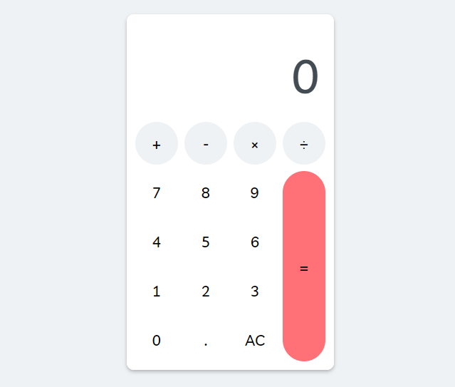

# Projet : Calculatrice

Developper cette calculatrice construite en HTML, CSS et JS

Liens utiles:

https://developer.mozilla.org/fr/docs/Learn/JavaScript/Building_blocks/Events

https://developer.mozilla.org/fr/docs/Web/API/Event/target

https://developer.mozilla.org/fr/docs/Web/API/Document/querySelector

https://developer.mozilla.org/fr/docs/Web/API/Document/querySelectorAll

https://developer.mozilla.org/fr/docs/Web/API/HTMLOrForeignElement/dataset